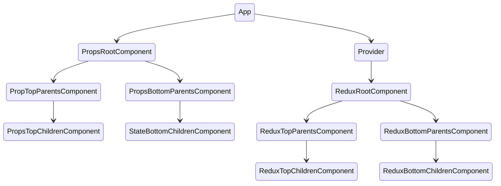
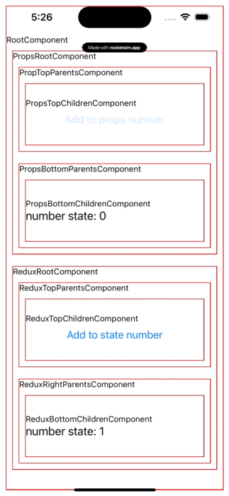

# react-native-redux-typescript

Generate to project with `CRNA`
```bash
$ npx create-react-native-app
```
Add TypeScript and the types for React Native and Jest to your project
```bash
$ yarn add -D typescript @types/jest @types/react @types/react-native @types/react-test-renderer @tsconfig/react-native
```

Add a TypeScript config file. Create a tsconfig.json in the root of your project.
```json
{
  "extends": "@tsconfig/react-native/tsconfig.json"
}
```
Create a jest.config.js file to configure Jest to use TypeScript
```javascript
module.exports = {
  preset: 'react-native',
  moduleFileExtensions: ['ts', 'tsx', 'js', 'jsx', 'json', 'node']
};
```
Install to Redux Core
```bash
# NPM
$ npm install redux

# Yarn
$ yarn add redux
```
Complementary Packages
```bash
# NPM
$ npm install react-redux

# Yarn
$ yarn add react-redux

```
Check dependency to `@type/react-redux` and if not found manually install them
```bash
# NPM
$ npm install @types/react-redux

# Yarn
$ yarn add @types/react-redux
```



Ref.
> https://github.com/expo/create-react-native-app  
> https://reactnative.dev/docs/next/typescript  
> https://redux.js.org/tutorials/typescript-quick-start  
